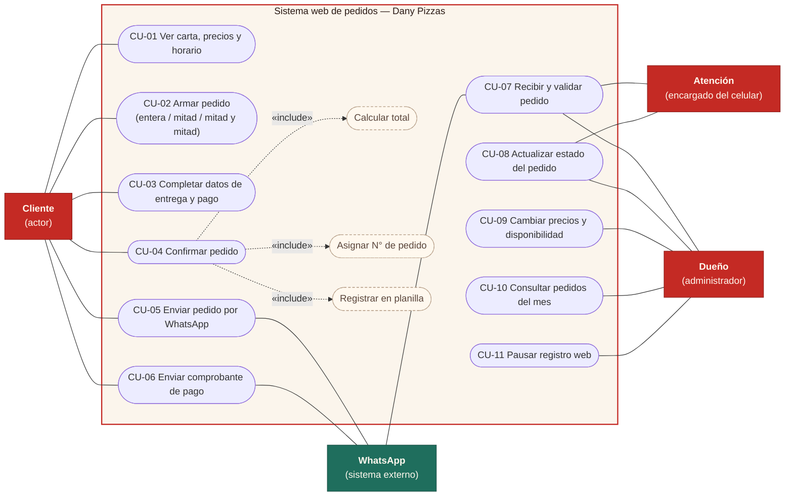
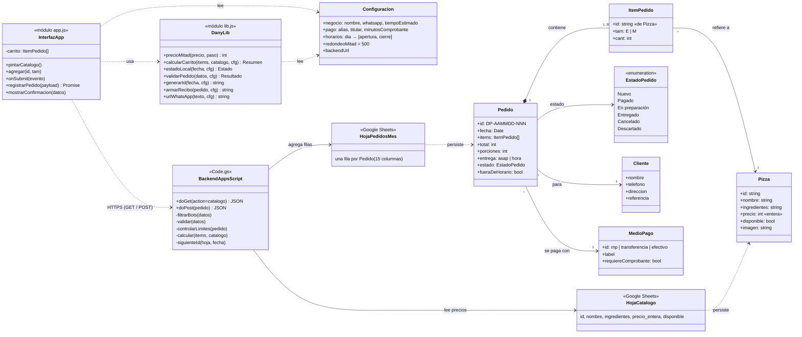
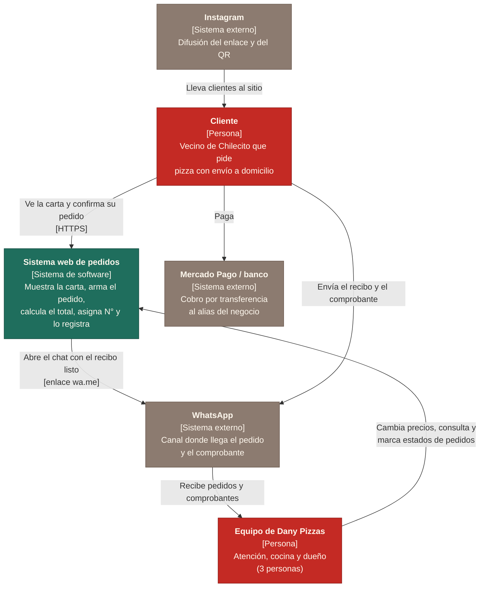
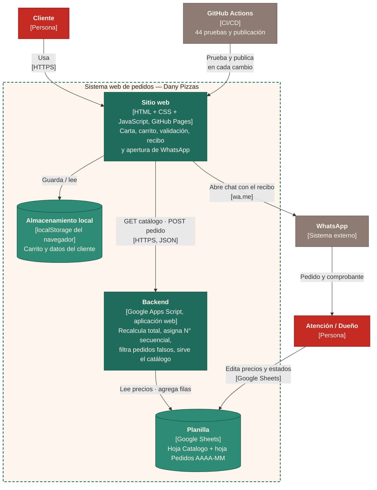
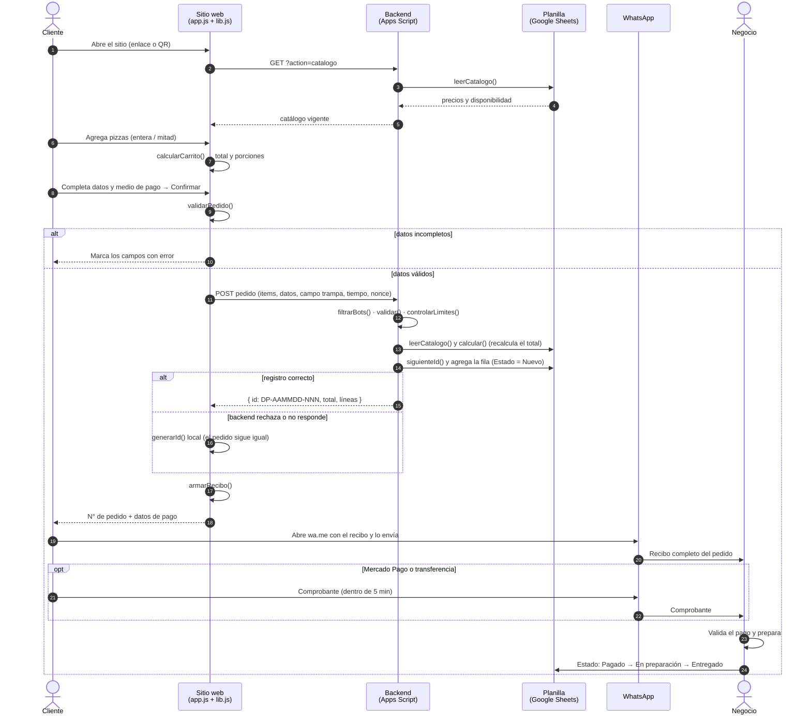

# Diagramas — Dany Pizzas

Fuente en Mermaid (`.mmd`): GitHub los dibuja directamente en esta página. Las imágenes `.png` (para presentaciones) y `.svg` (para documentos, escalan sin perder calidad) se generan desde la misma fuente.

Para regenerar las imágenes después de editar un `.mmd`:

```bash
npx -p @mermaid-js/mermaid-cli mmdc -i diagramas/clases.mmd -o diagramas/clases.png -b white -s 2
```

## 1. Casos de uso

Qué puede hacer cada actor con el sistema. CU-04 *Confirmar pedido* incluye calcular el total, asignar el N° de pedido y registrarlo en la planilla.

Imagen: [`casos-de-uso.png`](casos-de-uso.png) · [`casos-de-uso.svg`](casos-de-uso.svg)



## 2. Clases (modelo de dominio y módulos)

Entidades del negocio (Pedido, ItemPedido, Pizza, Cliente, MedioPago, EstadoPedido) y los módulos del código que las usan (`app.js`, `lib.js`, `Code.gs`) y las hojas de Google Sheets donde se guardan.

Imagen: [`clases.png`](clases.png) · [`clases.svg`](clases.svg)



## 3. C4 — Nivel 1: Contexto

El sistema como una caja negra: quiénes lo usan (cliente y equipo) y con qué sistemas externos se relaciona (WhatsApp, Mercado Pago / banco, Instagram).

Imagen: [`c4-contexto.png`](c4-contexto.png) · [`c4-contexto.svg`](c4-contexto.svg)



## 4. C4 — Nivel 2: Contenedores

Las piezas desplegables dentro del sistema: sitio web (GitHub Pages), almacenamiento local del navegador, backend (Google Apps Script) y planilla (Google Sheets), más la publicación automática con GitHub Actions.

Imagen: [`c4-contenedores.png`](c4-contenedores.png) · [`c4-contenedores.svg`](c4-contenedores.svg)



## 5. Secuencia — Hacer un pedido

El flujo completo de un pedido, incluido qué pasa si los datos están incompletos o si el backend no responde (el pedido sigue igual por WhatsApp).

Imagen: [`secuencia-pedido.png`](secuencia-pedido.png) · [`secuencia-pedido.svg`](secuencia-pedido.svg)


