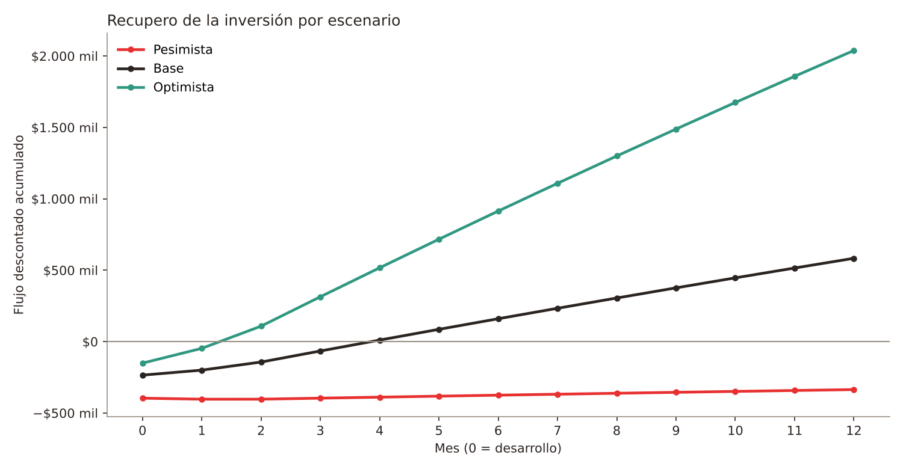
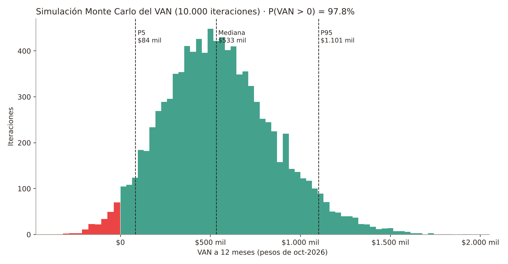
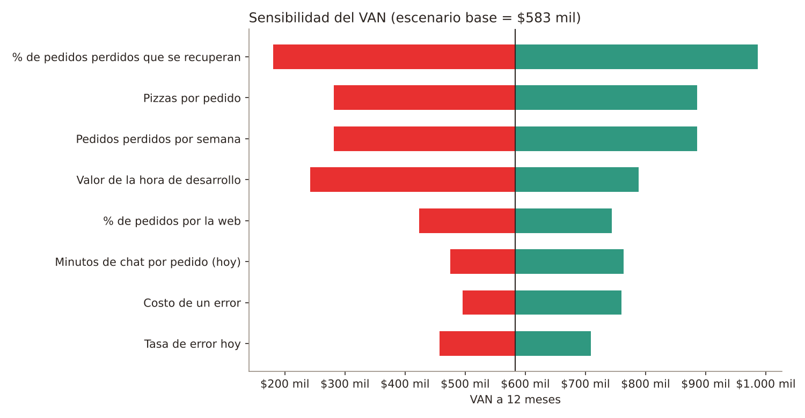

# Evaluación económico-financiera — Dany Pizzas Web

> Versión 1.0 · 07/10/2026 · Datos del negocio: respuestas del 07/10 (`PENDIENTES_DEL_USUARIO.md`, sección C).
> Cálculo reproducible: `economia/evaluacion_economica.py` (Python + NumPy, semilla fija 2026). Resultados completos en `economia/resultados.json`.
> ⚠️ Los valores marcados como **supuesto** no los dio el negocio; se toman con un rango amplio y se miden en el primer mes de uso.

## 1. Planteo

| Elemento | Definición |
|---|---|
| Horizonte | 12 meses, flujos mensuales (mes 0 = desarrollo). |
| Moneda | Pesos argentinos de octubre de 2026, a valores constantes. |
| Tasa de descuento | TNA 17,5 % (plazo fijo a 30 días, Banco Nación, octubre 2026) → **1,458 % mensual**. Es el costo de oportunidad del dinero para el negocio. Como los flujos están en pesos constantes y la tasa es nominal, el descuento es **conservador** (castiga de más al proyecto). |
| Método | **Simulación Monte Carlo** (10.000 iteraciones, distribuciones triangulares mínimo / más probable / máximo) + **tres escenarios** deterministas + **análisis de sensibilidad** (tornado). |
| Indicadores | VAN, TIR mensual, ROI, relación beneficio/costo (B/C) y período de recupero descontado. |

### Qué se valora como beneficio

El sistema no cambia el precio ni el producto. Se valoran tres efectos:

1. **Tiempo de atención ahorrado.** Hoy cada pedido lleva de 2 a 10 minutos de chat; un pedido que llega armado desde la web solo requiere confirmar el pago.
2. **Errores evitados.** Hoy 1 de cada 10 pedidos tiene un error; el recibo estructurado y la validación de datos lo reducen.
3. **Pedidos perdidos que se recuperan.** Hoy se pierde aproximadamente 1 pedido por noche por no contestar a tiempo; con la web el cliente puede completar el pedido sin esperar a que lo atiendan.

Los beneficios 1 y 2 se aplican solo a los pedidos que entran por la web (**adopción**). Todos los beneficios crecen con una **rampa**: 50 % el mes 1, 75 % el mes 2 y 100 % desde el mes 3.

### Qué se valora como costo

| Costo | Valor |
|---|---|
| Desarrollo (inversión, mes 0) | Horas de desarrollo × valor de la hora del desarrollador |
| Mantenimiento mensual | Horas por mes × valor de la hora del desarrollador |
| Infraestructura | **$0** (GitHub Pages y Google Apps Script/Sheets en su nivel gratuito; RNF-14) |

## 2. Variables y fuentes

| Variable | Mín. | Más probable | Máx. | Fuente |
|---|---:|---:|---:|---|
| Pedidos por noche, martes a viernes (4 noches) | 5 | **7** | 9 | Negocio: “promedio de 7” |
| Pedidos por noche, sábado y domingo (2 noches) | 9 | **11** | 13 | Negocio: “11 en fin de semana” |
| Pizzas por pedido | 1 | **2** | 3 | Negocio: “entre 1 y 3” |
| Precio promedio de una pizza | | **$9.500** | | Promedio de la carta (7 variedades) |
| Margen de ganancia sobre el precio | 35 % | **40 %** | 45 % | Negocio: “ganancia del 40 %” |
| Minutos de chat por pedido, hoy | 2 | **5** | 10 | Negocio: “2 a 10 minutos” |
| Pedidos con error, hoy | 5 % | **10 %** | 15 % | Negocio: “1 de cada 10” |
| Pedidos perdidos por semana | 3 | **6** | 9 | Negocio: “aprox. 1 por día” |
| Minutos de atención con la web | 0,5 | **1** | 2 | Supuesto (solo confirmar el pago) |
| Pedidos con error con la web | 1 % | **3 %** | 5 % | Supuesto |
| % de pedidos que entran por la web | 20 % | **40 %** | 60 % | Supuesto |
| % de pedidos perdidos que la web recupera | 10 % | **30 %** | 50 % | Supuesto |
| Costo de un error (en insumos de pizza) | 0,25 | **0,5** | 1 | Supuesto (descuento, rehacer o reenviar) |
| Valor de la hora de atención | $1.956 | **$2.445** | $2.934 | Salario Mínimo Vital y Móvil (SMVM) de octubre 2026, $1.956/h, hasta 1,5 × SMVM (el negocio no tiene el dato) |
| Horas de desarrollo | 40 | **48** | 60 | Estudiante: “48 horas aprox.” |
| Valor de la hora de desarrollo | $1.956 | **$4.890** | $9.780 | Supuesto: de 1 a 5 × SMVM (no hay referencia de mercado local) |
| Horas de mantenimiento por mes | 1 | **2** | 4 | Supuesto |

**Supuestos de cálculo:** “fin de semana” = sábado y domingo; viernes se cuenta como día de semana (conservador). Un mes = 52/12 semanas. Con estos valores el negocio hace hoy **50 pedidos por semana (≈ 217 por mes)** y gana ≈ **$3.800 por pizza**.

## 3. Escenario base, paso a paso

| Concepto | Cálculo | $/mes (estable) |
|---|---|---:|
| Pedidos por la web | 216,7 × 40 % | 86,7 pedidos |
| Tiempo ahorrado | 86,7 × (5 − 1) min ÷ 60 × $2.445 | **$14.127** |
| Errores evitados | 86,7 × (10 % − 3 %) × 0,5 × $5.700 de insumos | **$17.290** |
| Pedidos recuperados | 6 × 4,33 × 30 % = 7,8 pedidos × 2 pizzas × $3.800 | **$59.280** |
| **Beneficio mensual** | | **$90.697** |
| Mantenimiento | 2 h × $4.890 | −$9.780 |
| **Inversión (mes 0)** | 48 h × $4.890 | **$234.720** |

## 4. Resultados

### 4.1 Tres escenarios

En el pesimista y el optimista **cada variable se mueve a mitad de camino** entre su valor más probable y su extremo desfavorable o favorable, todas a la vez.

| Indicador | Pesimista | **Base** | Optimista |
|---|---:|---:|---:|
| Inversión | $396.090 | **$234.720** | $150.612 |
| Beneficio mensual estable | $29.494 | **$90.697** | $220.125 |
| VAN (12 meses) | −$335.891 | **$583.451** | $2.038.551 |
| TIR mensual | −18,4 % | **26,8 %** | 97,5 % |
| ROI (12 meses) | −50 % | **190 %** | 1.067 % |
| Relación B/C | 0,47 | **2,71** | 10,86 |
| Recupero descontado | no se recupera | **3,9 meses** | 1,3 meses |

### 4.2 Simulación Monte Carlo (10.000 iteraciones)

| Indicador | Media | P5 | Mediana | P95 |
|---|---:|---:|---:|---:|
| VAN | $552.992 | $84.479 | $532.611 | $1.101.041 |
| TIR mensual | 24,6 % | 4,9 % | 22,9 % | 50,6 % |
| ROI | 177 % | 24 % | 149 % | 422 % |
| B/C | 2,59 | 1,16 | 2,33 | 4,89 |
| Recupero (meses) | 4,8 | 2,3 | 4,3 | 8,8 |

**Probabilidad de VAN positivo: 97,8 %.** En el 97,8 % de las iteraciones la inversión se recupera dentro de los 12 meses.

**Por qué el escenario pesimista da negativo y el Monte Carlo no:** el pesimista supone que *todas* las variables salen mal al mismo tiempo (menos pedidos, menos adopción, hora de desarrollo cara, pocos errores evitados…). La simulación muestra que esa combinación es muy poco probable: solo el 2,2 % de los casos termina con VAN negativo.

### 4.3 Sensibilidad (tornado)

- La variable que más pesa es el **% de pedidos perdidos que la web recupera**, seguida por los **pedidos perdidos por semana** y las **pizzas por pedido**. Es decir: el valor del proyecto está más en **no perder ventas** que en ahorrar minutos.
- Aun con el recupero en su mínimo (10 %), el VAN base sigue siendo positivo (≈ $180.000).
- **Punto de equilibrio:** si la web no recuperara ningún pedido, el VAN sería ≈ −$21.000 (prácticamente cero): el ahorro de tiempo y de errores casi paga solo el proyecto. **Alcanza con recuperar un pedido perdido cada 3 o 4 meses** para que el VAN sea positivo.
- La segunda fuente de incertidumbre es el **valor de la hora de desarrollo**: aun valuada a 5 × SMVM, el VAN base sigue positivo (≈ $242.000).

## 5. Conclusión

Con los datos del negocio y supuestos prudentes, el proyecto es **económicamente conveniente**: en el escenario base se recupera en unos 4 meses, devuelve $2,71 por cada peso invertido y tiene un 97,8 % de probabilidad de VAN positivo. El riesgo principal no es técnico sino de **adopción**: que los clientes usen la web. Por eso las metas del primer mes deben medir:

1. Cantidad de pedidos por la web (planilla mensual, RF-17) frente al total.
2. Pedidos perdidos por semana (anotarlo a mano durante un mes).
3. Pedidos con error (estado “Cancelado” o nota en la planilla).

Con esas tres mediciones se reemplazan los supuestos por datos reales y se recalcula (cambiar `PARAMS` en el script y volver a ejecutarlo).

## 6. Limitaciones

- Los beneficios de tiempo son **ahorros de esfuerzo**, no ingresos en efectivo: liberan a quien atiende para otras tareas.
- El margen del 40 % se interpreta **sobre el precio de venta**. Si fuera sobre el costo (markup), la ganancia por pizza sería ≈ $2.714 en vez de $3.800 y los beneficios por recupero bajarían un 29 %; el VAN base seguiría positivo (≈ $444.000).
- No se incluye el costo de envío (lo cobra el repartidor externo) ni el dominio propio (opcional).
- Capacidad: una noche fuerte (11 pedidos × 2 pizzas = 22 pizzas) son 4 tandas del horno de 6 moldes; recuperar ~2 pedidos por semana no excede la capacidad.

## Fuentes de referencia

- Salario Mínimo Vital y Móvil desde el 01/10/2026: $391.200 mensuales y $1.956 por hora (Resolución 4/2026 del Consejo Nacional del Empleo, la Productividad y el SMVM). Infozona, “Octubre arranca con otro aumento del salario mínimo”: https://www.infozona.com.ar/salario-minimo-octubre-2026/
- Tasas de plazo fijo a 30 días (Banco Nación 17,5 % TNA): BAE Negocios, “Se desplomó el plazo fijo…”: https://www.baenegocios.com/economia/se-desplomo-el-plazo-fijo-y-paga-la-peor-tasa-en-lo-que-va-de-2026-cuando-rinden-2-000-000-al-mes-3643/ — **verificar la tasa vigente el día de la exposición**; si cambia, editar `TNA` en el script.
