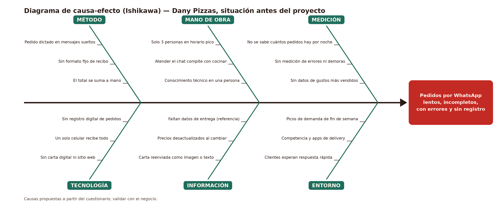

# Diagrama de causa-efecto (Ishikawa) — Dany Pizzas

> Situación **antes** del proyecto. Causas propuestas a partir del cuestionario y **aprobadas por el negocio el 07/10/2026**.
> Editable: [`ishikawa.drawio`](ishikawa.drawio) · Imagen: [`ishikawa.png`](ishikawa.png)

**Efecto (problema):** pedidos por WhatsApp lentos, incompletos, con errores y sin registro.

| Categoría | Causas | Qué la ataca en el producto |
|---|---|---|
| Método | Pedido dictado en mensajes sueltos · Sin formato fijo de recibo · El total se suma a mano | RF-03 a RF-05, RF-12 |
| Mano de obra | Solo 3 personas en horario pico · Atender el chat compite con cocinar · Conocimiento técnico en una persona | RF-03 (autoservicio), RNF-11, RNF-12 |
| Medición | No se sabe cuántos pedidos hay por noche · Sin medición de errores ni demoras · Sin datos de gustos más vendidos | RF-14, RF-17 |
| Tecnología | Sin carta digital ni sitio web · Un solo celular recibe todo · Sin registro digital de pedidos | RF-01, RF-12, RF-14 |
| Información | Carta reenviada como imagen o texto · Precios desactualizados al cambiar · Faltan datos de entrega (referencia) | RF-01, RF-07, RF-15 |
| Entorno | Clientes esperan respuesta rápida · Competencia y apps de delivery · Picos de demanda de fin de semana | RNF-01, RF-18 |
