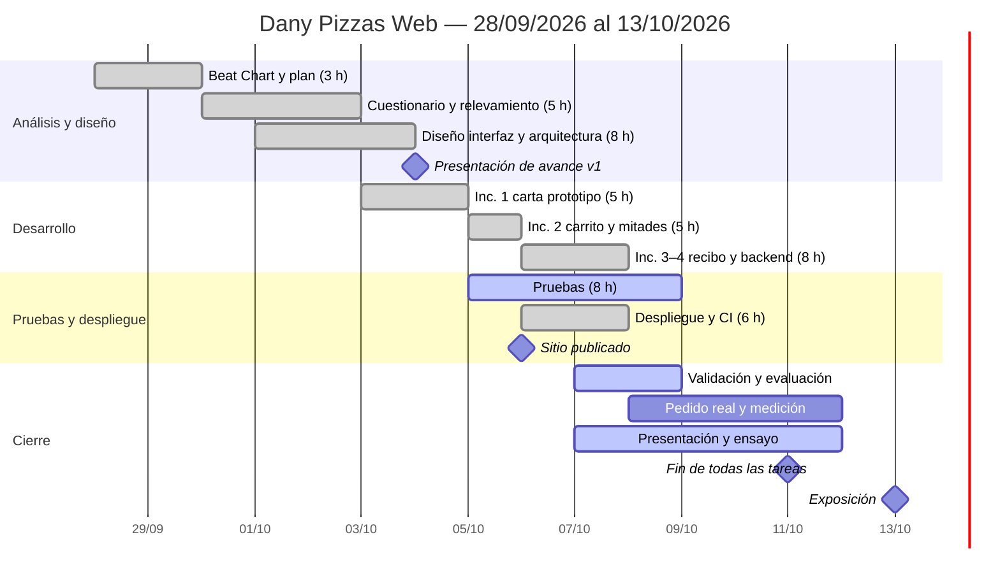

# Cronograma (Gantt) — Dany Pizzas Web

> Plan actualizado el 07/10/2026. El proyecto ocupa **dos semanas: del lunes 28/09 al domingo 11/10/2026**. Todas las tareas terminan el domingo 11/10 y la exposición es el **martes 13/10/2026**.
> Es el mismo cronograma de la diapositiva 10 de `DanyPizzas_Presentacion.pptx`.
> Las **48 horas** del presupuesto (diapositiva 11) se reparten así: análisis 8 · diseño 8 · desarrollo 18 · pruebas 8 · despliegue 6. Las tareas académicas (validación, evaluación económica, pedido real y presentación) no suman al presupuesto del producto.

## 1. Tareas

| ID | Macrofase | Tarea | Inicio | Fin | Días | Horas | Depende de | Responsable | Avance al 07/10 |
|---|---|---|---|---|---:|---:|---|---|---:|
| T1 | Análisis | Beat Chart y plan de trabajo (enfoque, modelo incremental, Scrumban) | lun 28/09 | mar 29/09 | 2 | 3 | — | Estudiante | 100 % |
| T2 | Análisis | Cuestionario del producto y relevamiento con el negocio | mié 30/09 | vie 02/10 | 3 | 5 | T1 | Estudiante + negocio | 100 % |
| T3 | Diseño | Diseño: interfaz, recibo y arquitectura | jue 01/10 | sáb 03/10 | 3 | 8 | T2 | Estudiante | 100 % |
| T4 | Desarrollo | Incremento 1: carta (prototipo) | sáb 03/10 | dom 04/10 | 2 | 5 | T3 | Estudiante | 100 % |
| T5 | Desarrollo | Incremento 2: carrito y mitades | lun 05/10 | lun 05/10 | 1 | 5 | T4 | Estudiante | 100 % |
| T6 | Desarrollo | Incrementos 3–4: recibo a WhatsApp, backend y planilla | mar 06/10 | mié 07/10 | 2 | 8 | T5 | Estudiante | 100 % |
| T7 | Pruebas | Pruebas (44 automáticas, punta a punta y aceptación) | lun 05/10 | jue 08/10 | 4 | 8 | T5 | Estudiante | 80 % |
| T8 | Despliegue | Despliegue (GitHub Pages, Apps Script) e integración continua | mar 06/10 | mié 07/10 | 2 | 6 | T6 | Estudiante | 100 % |
| T9 | Cierre | Validación con el negocio y evaluación económica | mié 07/10 | jue 08/10 | 2 | — | T2, T8 | Dueño + estudiante | 80 % |
| T10 | Cierre | Pedido real de prueba y medición de uso | jue 08/10 | dom 11/10 | 4 | — | T8 | Estudiante + atención al cliente | 0 % |
| T11 | Cierre | Presentación final y ensayo | mié 07/10 | dom 11/10 | 5 | — | T9 | Estudiante | 60 % |
| | | **Total del producto** | | | | **48** | | | |

**Hitos (duración 0):**

| ID | Hito | Fecha |
|---|---|---|
| H1 | Presentación de avance (v1) lista | dom 04/10/2026 |
| H2 | Sitio publicado | mar 06/10/2026 |
| H3 | Análisis aprobado por el dueño | mié 07/10/2026 |
| H4 | Fin de todas las tareas | dom 11/10/2026 |
| H5 | Exposición | mar 13/10/2026 |

> ⚠️ **A confirmar por el estudiante:** el incremento 1 (prototipo de la carta, 03–04/10) se ubicó antes de crear el repositorio (05/10 a la noche), como prototipo local. Si empezaste a programar más tarde, decímelo y lo corro.

Carga por día: semana 1 ≈ 1,5 a 3 h por día; semana 2 ≈ 7 a 9 h por día del lunes 05 al miércoles 07, y después menos.

Colores usados en la presentación: análisis y diseño gris `#8A7F76`; desarrollo rojo `#E83030`; pruebas y despliegue verde `#309880`; cierre verde oscuro `#1F6E5C`; presentación casi negro `#2B2420`.

## 2. Prompt para otra IA (Gantt editable)

Copiá todo el bloque y pegalo en la otra IA. Pide una planilla de Excel / Google Sheets en la que las barras se recalculan solas al cambiar las fechas.

```text
Necesito un diagrama de Gantt EDITABLE en una planilla (Excel .xlsx que también abra bien en Google Sheets) para mi proyecto universitario "Dany Pizzas Web" (Ingeniería de Software, Universidad Nacional de Moquegua, Comisión A; estudiante: Máximo Daniel Castro; docente: Dr. Alexander Morales Gonzales).

Requisitos del archivo:
1. Hoja "Tareas" con estas columnas: ID, Macrofase, Tarea, Inicio, Fin, Días (fórmula =Fin-Inicio+1), Horas, Depende de, Responsable, % Avance.
2. A la derecha de la tabla, una columna por día desde el lunes 28/09/2026 hasta el martes 13/10/2026. Encabezado en dos filas: arriba "Semana 1" (28/09–04/10), "Semana 2" (05/10–11/10) y "Expo"; abajo la inicial del día en español (L, M, M, J, V, S, D) y el número de día.
3. Las barras se dibujan con FORMATO CONDICIONAL (no con formas ni imágenes): una celda se pinta si su fecha está entre Inicio y Fin de la fila. Si cambio una fecha, la barra se mueve sola. Un color por macrofase (indicado abajo). Si se puede, la parte avanzada (según % Avance) en un tono más oscuro.
4. Los hitos van como filas aparte con duración 0 y se marcan con ◆ en la celda de su fecha.
5. Una columna resaltada para "hoy" con HOY() / TODAY().
6. Debajo de la columna Horas, una fila "Total" con =SUMA() (debe dar 48).
7. Una segunda hoja "Horas por macrofase" con una tabla dinámica o SUMAR.SI por macrofase: Análisis 8, Diseño 8, Desarrollo 18, Pruebas 8, Despliegue 6 (total 48).
8. Fechas en formato dd/mm/aaaa, idioma español, encabezados inmovilizados, columnas de días angostas (≈ 4), impresión en A4 horizontal ajustada a una página.
9. Sin macros. Que siga funcionando si agrego filas copiando una existente.
10. Título: "Cronograma del proyecto Dany Pizzas Web — 28/09/2026 al 13/10/2026".

Datos (fechas del año 2026; "—" = tarea académica sin horas del presupuesto):

| ID | Macrofase | Tarea | Inicio | Fin | Horas | Depende de | Responsable | % Avance | Color |
|---|---|---|---|---|---|---|---|---|---|
| T1 | Análisis | Beat Chart y plan de trabajo | 28/09 | 29/09 | 3 | — | Estudiante | 100 | #8A7F76 |
| T2 | Análisis | Cuestionario del producto y relevamiento con el negocio | 30/09 | 02/10 | 5 | T1 | Estudiante + negocio | 100 | #8A7F76 |
| T3 | Diseño | Diseño: interfaz, recibo y arquitectura | 01/10 | 03/10 | 8 | T2 | Estudiante | 100 | #8A7F76 |
| T4 | Desarrollo | Incremento 1: carta (prototipo) | 03/10 | 04/10 | 5 | T3 | Estudiante | 100 | #E83030 |
| T5 | Desarrollo | Incremento 2: carrito y mitades | 05/10 | 05/10 | 5 | T4 | Estudiante | 100 | #E83030 |
| T6 | Desarrollo | Incrementos 3–4: recibo a WhatsApp, backend y planilla | 06/10 | 07/10 | 8 | T5 | Estudiante | 100 | #E83030 |
| T7 | Pruebas | Pruebas (44 automáticas, punta a punta y aceptación) | 05/10 | 08/10 | 8 | T5 | Estudiante | 80 | #309880 |
| T8 | Despliegue | Despliegue (GitHub Pages, Apps Script) e integración continua | 06/10 | 07/10 | 6 | T6 | Estudiante | 100 | #309880 |
| T9 | Cierre | Validación con el negocio y evaluación económica | 07/10 | 08/10 | — | T2, T8 | Dueño + estudiante | 80 | #1F6E5C |
| T10 | Cierre | Pedido real de prueba y medición de uso | 08/10 | 11/10 | — | T8 | Estudiante + atención al cliente | 0 | #1F6E5C |
| T11 | Cierre | Presentación final y ensayo | 07/10 | 11/10 | — | T9 | Estudiante | 60 | #2B2420 |
| H1 | Hito | Presentación de avance (v1) | 04/10 | 04/10 | — | T2 | — | 100 | ◆ |
| H2 | Hito | Sitio publicado | 06/10 | 06/10 | — | T8 | — | 100 | ◆ |
| H3 | Hito | Análisis aprobado por el dueño | 07/10 | 07/10 | — | T9 | — | 100 | ◆ |
| H4 | Hito | Fin de todas las tareas | 11/10 | 11/10 | — | T10, T11 | — | 0 | ◆ |
| H5 | Hito | Exposición | 13/10 | 13/10 | — | H4 | — | 0 | ◆ |

Debajo del Gantt, una leyenda con los colores por macrofase y la nota: "Total del producto: 48 horas en dos semanas. Todas las tareas terminan el domingo 11/10/2026; la exposición es el martes 13/10/2026."
Entregame el archivo .xlsx listo para descargar y explicame en 3 líneas cómo cambiar una fecha o agregar una tarea.
```

## 3. Si la otra IA no puede generar archivos

Pedile el mismo cronograma en **Mermaid** (se edita como texto y se ve en https://mermaid.live):


