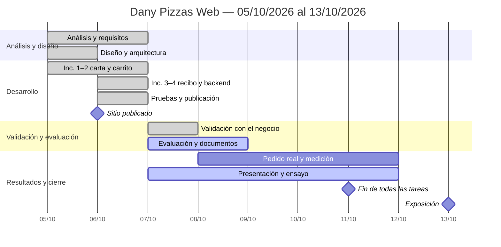

# Cronograma (Gantt) — Dany Pizzas Web

> Plan aprobado el 07/10/2026. Todas las tareas terminan el **domingo 11/10/2026**; la exposición es el **martes 13/10/2026**.
> Es el mismo cronograma de la diapositiva 10 de `DanyPizzas_Presentacion.pptx`.

## 1. Tareas

| ID | Fase | Tarea | Inicio | Fin | Días | Depende de | Responsable | Avance al 07/10 |
|---|---|---|---|---|---:|---|---|---:|
| T1 | Análisis | Análisis y requisitos (cuestionario, FODA, Ishikawa, RF/RNF) | lun 05/10 | mar 06/10 | 2 | — | Estudiante + negocio | 100 % |
| T2 | Diseño | Diseño y arquitectura | lun 05/10 | lun 05/10 | 1 | — | Estudiante | 100 % |
| T3 | Desarrollo | Incrementos 1–2: carta y carrito | lun 05/10 | mar 06/10 | 2 | T2 | Estudiante | 100 % |
| T4 | Desarrollo | Incrementos 3–4: recibo a WhatsApp, backend y planilla | mar 06/10 | mar 06/10 | 1 | T3 | Estudiante | 100 % |
| T5 | Pruebas | Pruebas (44 automáticas) y publicación | mar 06/10 | mar 06/10 | 1 | T4 | Estudiante | 100 % |
| T6 | Validación | Validación con el negocio (FODA, Ishikawa, requisitos, misión y visión) | mié 07/10 | mié 07/10 | 1 | T1 | Dueño + estudiante | 100 % |
| T7 | Evaluación | Evaluación económica (Monte Carlo) y documentos | mié 07/10 | jue 08/10 | 2 | T6 | Estudiante | 80 % |
| T8 | Resultados | Pedido real de prueba y medición de uso | jue 08/10 | dom 11/10 | 4 | T5 | Estudiante + atención al cliente | 0 % |
| T9 | Cierre | Presentación y ensayo | mié 07/10 | dom 11/10 | 5 | T6, T7 | Estudiante | 60 % |

**Hitos (duración 0):**

| ID | Hito | Fecha |
|---|---|---|
| H1 | Sitio publicado | mar 06/10/2026 |
| H2 | Análisis aprobado por el dueño | mié 07/10/2026 |
| H3 | Fin de todas las tareas | dom 11/10/2026 |
| H4 | Exposición | mar 13/10/2026 |

Colores usados en la presentación: análisis y diseño gris `#8A7F76`; desarrollo rojo `#E83030`; pruebas y medición verde `#309880`; validación y evaluación verde oscuro `#1F6E5C`; presentación casi negro `#2B2420`.

## 2. Prompt para otra IA (Gantt editable)

Copiá todo el bloque y pegalo en la otra IA. Pide una planilla de Excel / Google Sheets en la que las barras se recalculan solas al cambiar las fechas.

```text
Necesito un diagrama de Gantt EDITABLE en una planilla (Excel .xlsx que también abra bien en Google Sheets) para mi proyecto universitario "Dany Pizzas Web" (Ingeniería de Software, Universidad Nacional de Moquegua, Comisión A; estudiante: Máximo Daniel Castro; docente: Dr. Alexander Morales Gonzales).

Requisitos del archivo:
1. Hoja "Tareas" con estas columnas: ID, Fase, Tarea, Inicio, Fin, Días (fórmula =Fin-Inicio+1), Depende de, Responsable, % Avance.
2. A la derecha de la tabla, una columna por día desde el lunes 05/10/2026 hasta el martes 13/10/2026 (encabezado con día de la semana abreviado en español y número: "Lun 05", "Mar 06", ...).
3. Las barras se dibujan con FORMATO CONDICIONAL (no con formas ni imágenes): una celda se pinta si su fecha está entre Inicio y Fin de la fila. Así, si cambio una fecha, la barra se mueve sola. Usá un color por fase (indicado abajo). La parte ya avanzada de cada barra (según % Avance) puede ir en un tono más oscuro si es posible; si no, no hace falta.
4. Los hitos van como filas aparte con duración 0 y se marcan con el símbolo ◆ en la celda de su fecha.
5. Una línea o columna resaltada para "hoy" con la fórmula HOY() / TODAY().
6. Fechas en formato dd/mm/aaaa, idioma español, primera fila inmovilizada, ancho de columnas de días angosto (≈ 4), impresión en A4 horizontal ajustada a una página.
7. Sin macros. Que todo siga funcionando si agrego filas nuevas copiando una existente.
8. Título arriba: "Cronograma del proyecto Dany Pizzas Web — 05/10/2026 al 13/10/2026".

Datos (fechas del año 2026):

| ID | Fase | Tarea | Inicio | Fin | Depende de | Responsable | % Avance | Color |
|---|---|---|---|---|---|---|---|---|
| T1 | Análisis | Análisis y requisitos (cuestionario, FODA, Ishikawa, RF/RNF) | 05/10 | 06/10 | — | Estudiante + negocio | 100 | #8A7F76 |
| T2 | Diseño | Diseño y arquitectura | 05/10 | 05/10 | — | Estudiante | 100 | #8A7F76 |
| T3 | Desarrollo | Incrementos 1–2: carta y carrito | 05/10 | 06/10 | T2 | Estudiante | 100 | #E83030 |
| T4 | Desarrollo | Incrementos 3–4: recibo a WhatsApp, backend y planilla | 06/10 | 06/10 | T3 | Estudiante | 100 | #E83030 |
| T5 | Pruebas | Pruebas (44 automáticas) y publicación | 06/10 | 06/10 | T4 | Estudiante | 100 | #309880 |
| T6 | Validación | Validación con el negocio (FODA, Ishikawa, requisitos, misión y visión) | 07/10 | 07/10 | T1 | Dueño + estudiante | 100 | #1F6E5C |
| T7 | Evaluación | Evaluación económica (Monte Carlo) y documentos | 07/10 | 08/10 | T6 | Estudiante | 80 | #1F6E5C |
| T8 | Resultados | Pedido real de prueba y medición de uso | 08/10 | 11/10 | T5 | Estudiante + atención al cliente | 0 | #309880 |
| T9 | Cierre | Presentación y ensayo | 07/10 | 11/10 | T6, T7 | Estudiante | 60 | #2B2420 |
| H1 | Hito | Sitio publicado | 06/10 | 06/10 | T5 | — | 100 | ◆ |
| H2 | Hito | Análisis aprobado por el dueño | 07/10 | 07/10 | T6 | — | 100 | ◆ |
| H3 | Hito | Fin de todas las tareas | 11/10 | 11/10 | T8, T9 | — | 0 | ◆ |
| H4 | Hito | Exposición | 13/10 | 13/10 | H3 | — | 0 | ◆ |

Al final, debajo del Gantt, agregá una leyenda con los colores por fase y la nota "Todas las tareas terminan el domingo 11/10/2026; la exposición es el martes 13/10/2026."
Entregame el archivo .xlsx listo para descargar y explicame en 3 líneas cómo cambiar una fecha o agregar una tarea.
```

## 3. Si la otra IA no puede generar archivos

Pedile en su lugar el mismo cronograma en **Mermaid** (se edita como texto y se ve en https://mermaid.live):


